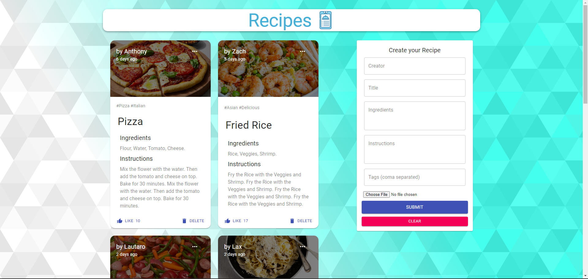
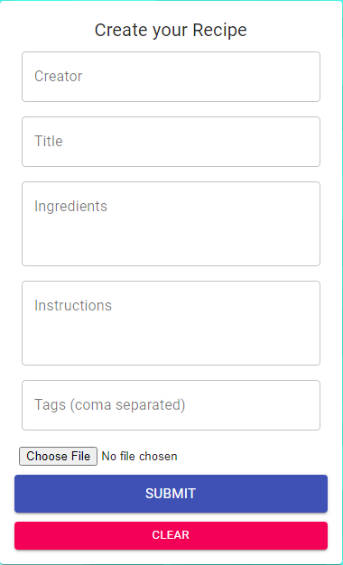
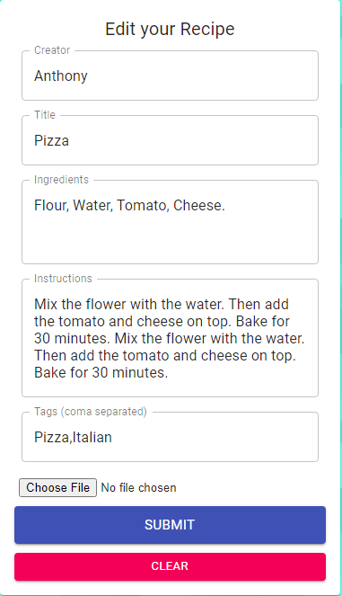
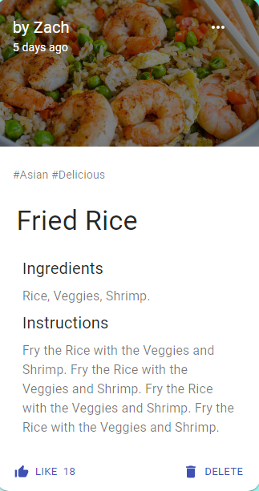

# Recipe Sharing Full Stack App (MERN Stack)

## Table of Contents

- [Screenshots](#screenshots)
- [Features](#features)
- [Prerequisites](#prerequisites)
- [Getting Started](#getting-started)
- [Folder Structure](#folder-structure)
- [Technologies Used](#technologies-used)
- [Live Demo](#live-demo)

- ## Screenshots
 
- ;
- ;
- ;
- ; 

## Features

1. **Recipe Management**: Create, edit, and delete your recipes.
2. **Like Recipes**: Save your favorite recipes for easy access.
3. **Responsive Design**: Works seamlessly on both desktop and mobile devices.

## Prerequisites

- [Node.js](https://nodejs.org/) installed (v14 or higher).
- [MongoDB](https://www.mongodb.com/) installed and running locally or on a remote server.
- [Git](https://git-scm.com/) for version control.
- A text editor or integrated development environment (IDE) of your choice (e.g., Visual Studio Code).

## Getting Started

1. Clone the repository:

   ```bash
   git clone https://github.com/lscolamiero/MERN-RECIPE-BOOK-MILESTONE-PROJECT-2.git

2. Navigate to the project directory:

       cd MERN-RECIPE-BOOK-MILESTONE-PROJECT-2

3. Navigate to package.json folder:

       add the following dependency: "type": "module",

       delete the “test” on the scripts and add the following: "start": "nodemon index.js"

4. Navigate to the frontend directory:
     
       cd frontend

5. Install frontend dependencies:

       npm i @material-ui/icons --legacy-peer-deps @material-ui/core --legacy-peer-deps @material-ui/lab material-ui-chip-input npm install
       
       npm start

6. Return to the project root:

       cd ..
       cd ..

7. Navigate to backend folder:

       cd backend

8. Create a `.env` file in the project root and configure your environment variables:
   
       PORT=5000
       MONGODB_URI=mongodb://localhost/recipe-app

9. Install backend dependencies:    

       npm install body-parser cors express mongoose nodemon

       npm start


       


## Folder Structure
The project follows a standard MERN stack folder structure:

- frontend: Contains the React frontend application.
- backend: Contains the Express.js backend application.
- models: Define the MongoDB schemas and models.
- routes: Define the API routes.
- controllers: Handle route logic and interact with the database.
- db: Configuration files (e.g., database connection).

## Technologies Used

#### Frontend:

- React

#### Backend:

- Node.js
- Express.js
- MongoDB (Mongoose)


 ## Live Demo 

 Check out the live demo of the Recipe Sharing Full Stack App [here](https://recipe-book-fe.netlify.app/).


